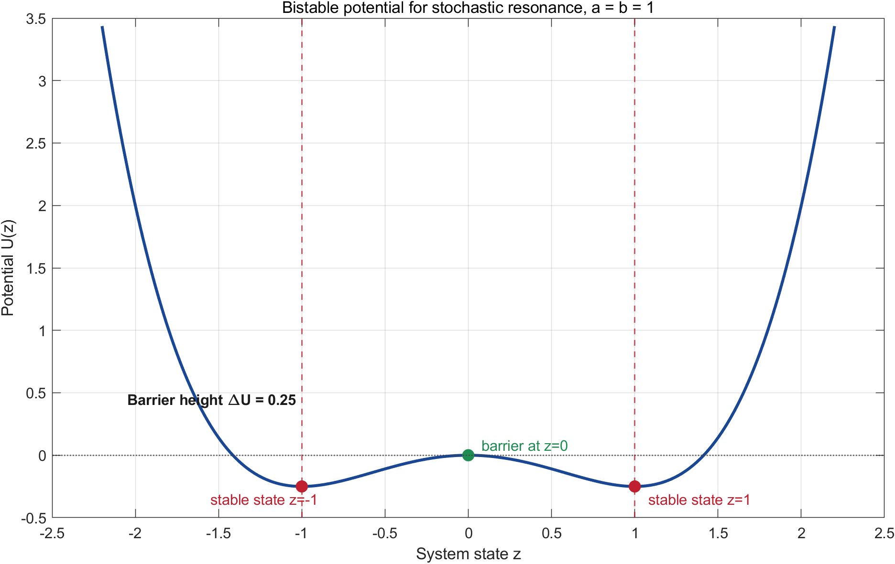
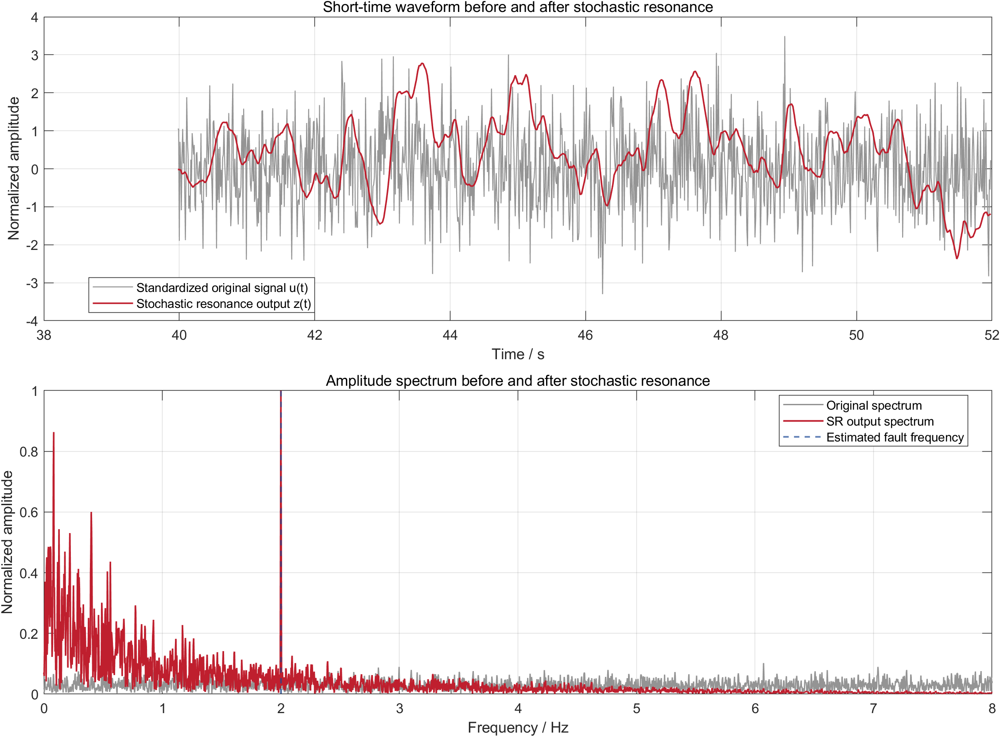
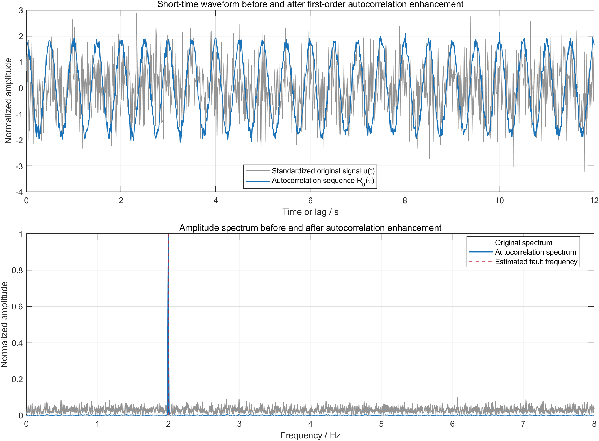
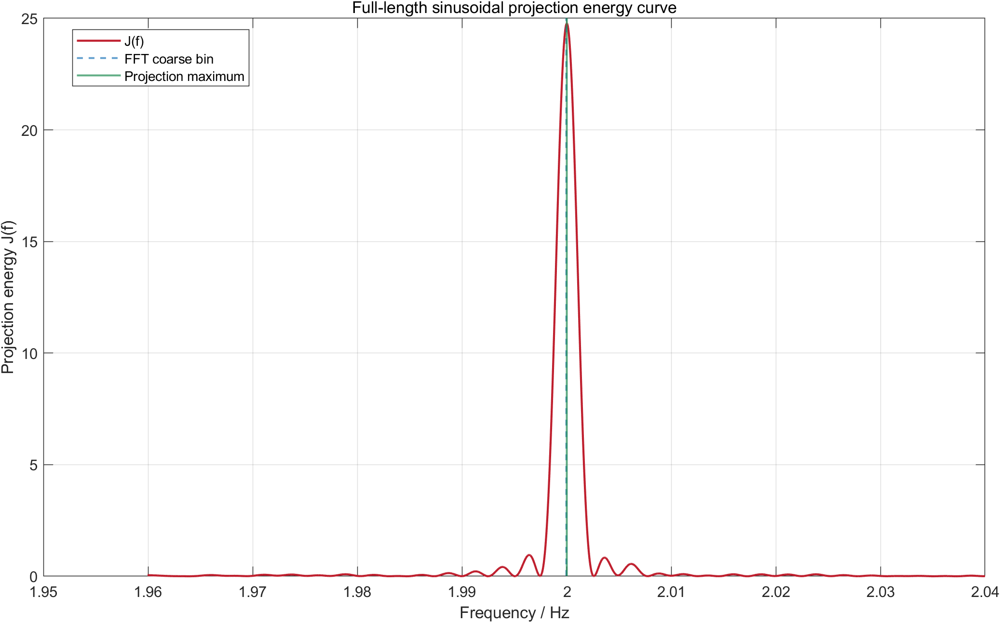
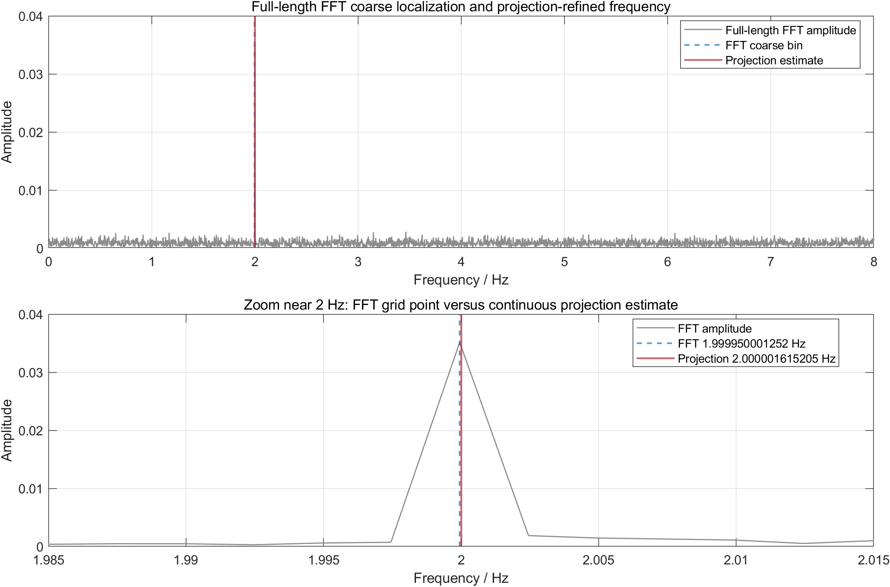

# 5.1 问题一模型的建立与求解

## 5.1.1 数据预处理

题目给出的单源故障信号可以看作由微弱周期故障分量、随机噪声以及可能存在的直流偏置共同组成。设原始观测数据为

\[
x_i=x(t_i),\quad i=1,2,\cdots,N,
\]

其中 \(t_i\) 为采样时刻，由于直流分量不携带故障周期信息，首先对原始信号进行去均值处理：

\[
y_i=x_i-\bar{x},\qquad 
\bar{x}=\frac{1}{N}\sum_{i=1}^{N}x_i.
\]

去均值后的信号 \(y_i\) 作为主模型的基本输入。由于第二问需要恢复故障分量的幅值 \(A\)，因此主模型保留去均值信号的原始幅值尺度，不再对 \(y_i\) 作幅值归一化。

但是随机共振和一阶自相关增强属于辅助预处理分支，其目的不是恢复真实幅值，而是增强弱周期分量的可检测性。为避免输入尺度影响非线性系统响应和相关函数幅值，本文对增强分支采用标准化输入：

\[
\sigma_y=\sqrt{\frac{1}{N-1}\sum_{i=1}^{N}y_i^2},
\qquad
u_i=\frac{y_i}{\sigma_y}.
\]

其中 \(u_i\) 为去均值并标准化后的信号。后续全长正弦投影主模型使用 \(y_i\)，随机共振和一阶自相关增强分支使用 \(u_i\)。

### （1）随机共振增强分支

随机共振是一种典型的非线性弱信号增强方法。其基本思想是：在合适的非线性系统中，微弱周期输入虽然本身不足以推动系统产生明显响应，但在噪声和非线性势阱共同作用下，系统状态可能在两个稳定状态之间发生近似周期性的跃迁，从而使原本被噪声淹没的周期信息在输出端表现得更加明显。

本文选用经典双稳态随机共振模型。设去均值并标准化后的输入信号为 \(u(t)\)，构造如下非线性动力系统：

\[
\frac{\mathrm{d}z}{\mathrm{d}t}=az-bz^3+k u(t),
\]

其中 \(z(t)\) 为系统输出，\(a>0\)、\(b>0\) 为双稳态系统参数，\(k\) 为输入增益。

上述微分方程可由势函数

\[
U(z)=-\frac{a}{2}z^2+\frac{b}{4}z^4
\]

导出。因为

\[
\frac{\mathrm{d}z}{\mathrm{d}t}
=-\frac{\mathrm{d}U(z)}{\mathrm{d}z}+k u(t),
\]

所以当 \(a>0,b>0\) 时，势函数 \(U(z)\) 具有两个稳定势阱和一个不稳定平衡点。两个稳定点为

\[
z=\pm \sqrt{\frac{a}{b}},
\]

势垒高度为

\[
\Delta U=\frac{a^2}{4b}.
\]

参数 \(a\) 和 \(b\) 决定双稳态系统的结构：\(a\) 越大，稳定点距离原点越远，势阱分离越明显；\(b\) 越大，非线性约束越强，系统输出不容易发散。输入增益 \(k\) 决定原信号对系统状态的驱动强度：若 \(k\) 过小，输入信号难以推动系统响应；若 \(k\) 过大，系统输出容易被噪声和非线性饱和影响，反而破坏周期结构。

本文参数选取遵循“结构固定、增益寻优”的原则。首先取

\[
a=1,\qquad b=1.
\]

此时双稳态系统的稳定点为 \(z=\pm 1\)，势垒高度为

\[
\Delta U=\frac{1}{4}.
\]

该取值具有两个好处：一是模型形式简洁，便于数值求解；二是稳定点和势垒高度均处于适中尺度，适合与标准化后的输入信号匹配。由于输入 \(u(t)\) 已经经过标准化处理，继续复杂调节 \(a,b\) 容易造成参数冗余，因此本文固定 \(a=b=1\)，只对输入增益 \(k\) 进行扫描。

输入增益 \(k\) 在区间

\[
k\in[0.02,0.40]
\]

内搜索。对每一个候选 \(k\)，用四阶 Runge--Kutta 方法求解随机共振系统，并计算输出 \(z(t)\) 在主模型频率附近的正弦投影占比和局部信噪比。最终选取使综合响应最明显的 \(k\) 作为随机共振分支参数。本文计算得到最优输入增益约为

\[
k=0.2733.
\]

下图给出了标准化原始信号 \(u(t)\) 与随机共振输出 \(z(t)\) 的短时时域波形和幅频谱对比。可以看到，随机共振输出在 2 Hz 附近仍具有响应，说明该方法能够作为一种弱信号增强尝试，用于验证目标周期分量是否存在。

### （2）一阶自相关增强分支

自相关函数用于刻画信号与其延迟版本之间的相似程度。对于周期信号，当延迟量等于周期的整数倍时，信号与延迟信号仍具有较强相关性；而随机噪声在非零滞后处相关性较弱。因此，自相关可以抑制随机扰动，并突出隐藏的周期结构。

本文对标准化信号 \(u_i\) 计算一阶自相关函数：

\[
R_u(k)=\frac{1}{N-k}\sum_{i=1}^{N-k}u_i u_{i+k},
\qquad k=0,1,\cdots,N-1.
\]

若原信号中存在周期分量 \(A\sin(2\pi f_0 t+\varphi)\)，则其自相关函数仍保留相同周期。对于本题中约 2 Hz 的故障频率，其周期约为

\[
T_0=\frac{1}{f_0}\approx0.5\ \mathrm{s}.
\]

因此，如果一阶自相关序列在滞后轴上呈现约 0.5 s 的重复结构，就可以作为故障周期存在的辅助证据。

实际计算中，为避免零滞后 \(R_u(0)\) 的大峰值影响观察，去掉零滞后项，并对正滞后自相关序列进行去趋势和标准化：

\[
\tilde{R}_u(k)=
\frac{R_u(k)-\overline{R_u}}{\sigma_R}.
\]

随后对 \(\tilde{R}_u(k)\) 进行与原信号相同的正弦投影检测。下图给出了标准化原始信号与一阶自相关增强序列的短时时域波形和幅频谱对比。自相关增强后，滞后域上的 0.5 s 周期结构更加清楚，频谱中 2 Hz 附近的峰值也更加集中。

一阶自相关增强后，滞后域周期结构更加清晰，估计频率为 \(2.000005328728\ \mathrm{Hz}\)，与全长正弦投影结果仅相差 \(3.71\times10^{-6}\ \mathrm{Hz}\)。但将该频率回代到原始信号中计算投影能量占比，结果略低于全长正弦投影模型。因此，一阶自相关主要提升周期可视化和辅助验证效果，并未提升最终频率精估精度。
## 5.1.2 基于全长正弦投影与相关检测的弱周期故障检测模型

机械设备发生单一周期性故障时，传感器观测信号中通常会包含一个微弱的近似周期分量。由于题目要求从强噪声背景中检测故障主频，本文将问题一抽象为含噪正弦信号的频率检测问题。对去均值后的观测信号建立模型：

\[
y(t_i)=A\sin(2\pi f t_i+\varphi)+\varepsilon_i,
\qquad i=1,2,\cdots,N,
\]

其中：

- \(A\) 为故障周期分量幅值；
- \(f\) 为待估计故障频率；
- \(\varphi\) 为初相位；
- \(\varepsilon_i\) 为噪声和其他未建模扰动。

问题一的核心目标是从强噪声背景中判断是否存在周期故障分量，并估计其频率 \(f\)。本文选择全长正弦投影作为主模型。这里的“全长”是指利用整个观测区间内的全部样本共同评价一个候选频率。对于任意候选频率 \(f\)，只需判断原始信号能否被该频率下的正弦、余弦基函数充分解释。

由于正弦函数可展开为

\[
A\sin(2\pi f t+\varphi)
=a\cos(2\pi f t)+b\sin(2\pi f t),
\]

其中

\[
a=A\sin\varphi,\qquad b=A\cos\varphi,
\]

于是对于任意给定频率 \(f\)，模型可以写成线性回归形式：

\[
\mathbf{y}=\mathbf{H}(f)\boldsymbol{\theta}+\boldsymbol{\varepsilon},
\]

其中

\[
\mathbf{y}=
\begin{bmatrix}
y_1\\y_2\\\vdots\\y_N
\end{bmatrix},
\quad
\boldsymbol{\theta}=
\begin{bmatrix}
a\\b
\end{bmatrix},
\quad
\mathbf{H}(f)=
\begin{bmatrix}
\cos(2\pi f t_1) & \sin(2\pi f t_1)\\
\cos(2\pi f t_2) & \sin(2\pi f t_2)\\
\vdots & \vdots\\
\cos(2\pi f t_N) & \sin(2\pi f t_N)
\end{bmatrix}.
\]

在给定 \(f\) 时，参数 \(\boldsymbol{\theta}\) 的最小二乘估计为

\[
\hat{\boldsymbol{\theta}}(f)
=
\left[\mathbf{H}^{T}(f)\mathbf{H}(f)\right]^{-1}
\mathbf{H}^{T}(f)\mathbf{y}.
\]

对应的拟合周期分量为

\[
\hat{\mathbf{s}}(f)=\mathbf{H}(f)\hat{\boldsymbol{\theta}}(f).
\]

若某一频率 \(f\) 处确实存在周期故障信号，则原信号在由 \(\cos(2\pi ft)\) 和 \(\sin(2\pi ft)\) 张成的二维正弦子空间上的投影能量会明显增大。因此定义全长正弦投影能量函数：

\[
J(f)=\|\hat{\mathbf{s}}(f)\|_2^2
=
\mathbf{y}^{T}\mathbf{H}(f)
\left[\mathbf{H}^{T}(f)\mathbf{H}(f)\right]^{-1}
\mathbf{H}^{T}(f)\mathbf{y}.
\]

最终频率估计问题转化为一维优化问题：

\[
\hat{f}_0=\arg\max_{f\in[f_{\min},f_{\max}]}J(f).
\]

从几何意义看，\(\mathbf{H}(f)\boldsymbol{\theta}\) 表示所有频率为 \(f\) 的正弦信号集合。给定 \(f\) 后，最小二乘估计实际上是在这个二维正弦子空间中寻找离观测向量 \(\mathbf{y}\) 最近的点。因此，\(J(f)\) 越大，说明观测信号中能够由该频率正弦分量解释的能量越多；由于 \(\|\mathbf{y}\|_2^2\) 对所有候选频率都相同，最大化 \(J(f)\) 也等价于最小化残差能量 \(\|\mathbf{y}-\hat{\mathbf{s}}(f)\|_2^2\)。

从相关检测意义看，本文实际是在每个候选频率下构造两路参考信号 \(\cos(2\pi ft)\) 和 \(\sin(2\pi ft)\)，并计算观测信号与这两路参考信号的全长相干相关。使用正弦、余弦两路参考的原因是故障信号初相位未知；单独与某一路参考相关时，若相位不匹配，相关值可能偏小，而两路相关能量合成后可以消除未知相位的影响。若候选频率接近真实故障频率，各采样点上的周期分量会在全长相关中同相累积；若候选频率偏离真实频率，相位会随时间逐渐漂移，正负相关项相互抵消，投影能量随之降低。

若从统计假设检验角度解释，在高斯噪声假设下，该投影能量检测量与广义似然比检验具有一致的判决形式。本文用全长正弦投影与相关检测作为计算方法，用广义似然比检验解释其统计意义。

设

\[
H_0:\mathbf{y}=\boldsymbol{\varepsilon},
\]

\[
H_1:\mathbf{y}=\mathbf{H}(f)\boldsymbol{\theta}+\boldsymbol{\varepsilon}.
\]

其中 \(H_0\) 表示不存在周期故障分量，\(H_1\) 表示存在频率为 \(f\) 的周期故障分量。在 \(H_1\) 下，未知参数 \(\boldsymbol{\theta}\) 由最小二乘估计给出。因此，比较不同频率处模型解释的能量大小，就等价于比较该频率下周期分量存在的可能性。

进一步地，\(J(f)\) 本质上是信号与两个正交参考基 \(\cos(2\pi ft)\)、\(\sin(2\pi ft)\) 的全长相干相关能量。若忽略归一化系数，可理解为

\[
J(f)\sim
\left|\langle \mathbf{y},\cos(2\pi f\mathbf{t})\rangle\right|^2
+
\left|\langle \mathbf{y},\sin(2\pi f\mathbf{t})\rangle\right|^2.
\]

因此，全长正弦投影模型既是一个参数化最小二乘模型，也可以理解为全长相关检测模型；在高斯噪声假设下，它的检测统计量又可由广义似然比检验推出。

## 5.1.3 模型求解过程与频率结果

根据上述模型，问题一的主频求解过程如下。

第一步，读取单源故障数据，得到观测序列 \(x_i\) 和采样时刻 \(t_i\)。由数据可知采样间隔为

\[
\Delta t=0.01\ \mathrm{s},
\]

因此采样频率为

\[
f_s=100\ \mathrm{Hz}.
\]

第二步，对原始信号进行去均值处理：

\[
y_i=x_i-\bar{x}.
\]

主模型直接使用 \(y_i\) 进行投影搜索，以保留原始幅值尺度；随机共振和一阶自相关增强分支再使用标准化信号

\[
u_i=\frac{y_i}{\sigma_y}.
\]

第三步，使用全长 FFT 对主频进行粗定位。普通 FFT 的最大频点为

\[
f_{\mathrm{FFT}}=1.999950001252\ \mathrm{Hz}.
\]

该结果说明故障主频位于 2 Hz 附近，但 FFT 频率只能落在离散频率栅格上，不能直接作为最终精确频率。

第四步，在粗定位频率附近建立频率搜索区间，例如

\[
f\in[1.959950001252,\ 2.039950001252]\ \mathrm{Hz}.
\]

对区间内每一个候选频率 \(f\)，建立矩阵 \(\mathbf{H}(f)\)，计算 \(\hat{\boldsymbol{\theta}}(f)\)、\(\hat{\mathbf{s}}(f)\) 和投影能量 \(J(f)\)。先通过密集网格搜索确定峰值附近位置，再用一维优化算法对峰值位置进行精化。

下图展示了连续频率搜索得到的全长正弦投影能量曲线。可以看到，\(J(f)\) 在目标频率附近形成尖锐峰值，这说明观测信号在该频率对应的正弦子空间上具有最大的相干投影能量。

第五步，最大化投影能量函数，得到全长正弦投影模型的频率估计：

\[
\hat f_0=2.000001615205\ \mathrm{Hz}.
\]

对应的投影能量为

\[
J(\hat f_0)=24.768425883189,
\]

残差能量为

\[
\|\mathbf{y}-\hat{\mathbf{s}}(\hat f_0)\|_2^2=400.119442268241.
\]

下图给出了普通 FFT 粗定位结果与全长正弦投影精估结果的对比。可以看出，FFT 只能给出离散频点 \(1.999950001252\ \mathrm{Hz}\)，而全长投影模型进一步在连续频率上确定峰值位置。

与传统傅里叶变换相比，全长正弦投影模型的优势主要体现在以下方面。

1. 普通 FFT 的频率结果受离散频率栅格限制，而全长投影模型直接在连续频率变量 \(f\) 上优化，能够得到更精细的频率估计。
2. FFT 更偏向频谱显示和粗定位，全长投影模型则建立了明确的参数化观测模型，可以自然给出投影能量、残差能量和检测统计量。
3. 全长投影利用全部观测数据与候选正弦基进行相干积累，真实周期分量在正确频率处累加增强，随机噪声则难以形成同相累积。

因此，本文将全长正弦投影与相关检测作为问题一的主模型，最终检测到的单源故障频率为

\[
\boxed{\hat f_0=2.000001615205\ \mathrm{Hz}}.
\]

## 5.1.4 辅助增强方法与模型筛选

为验证主频检测结果的稳定性，本文还尝试了一阶自相关增强和随机共振作为弱信号增强方法。

自相关函数能够削弱非周期随机扰动，使滞后域中的周期结构更加清晰。一阶自相关增强后得到的频率为 \(2.000005328728\ \mathrm{Hz}\)，与全长正弦投影结果 \(2.000001615205\ \mathrm{Hz}\) 相差约 \(3.71\times10^{-6}\ \mathrm{Hz}\)；其自相关域正弦投影能量占比为\(0.9512\)。该结果说明一阶自相关能够有效增强周期可视化，并可作为主频存在性的辅助验证。但将该频率回代到原始信号后，其原始信号投影能量占比略低于全长正弦投影模型，因此不作为最终精确测频方法。

随机共振输出局部信噪比约为 28.922 dB，但其频率估计为 \(1.999953369807\ \mathrm{Hz}\)，与主模型相差约 \(4.8\times10^{-5}\ \mathrm{Hz}\)。进一步扩大 \(k\in[0.005,1.50]\) 的敏感性分析后，频率仍稳定在 \(1.999953\ \mathrm{Hz}\) 附近，说明问题并非单纯由 \(k\) 未调好造成，而是双稳态非线性响应改变了原始频谱结构。因此，随机共振只作为尝试过的辅助增强方法，不参与最终频率估计。

## 5.1.5 本节模型小结

本节将弱故障检测问题抽象为含噪正弦信号的频率估计问题，建立了基于全长正弦投影与相关检测的检测模型。该模型以正弦子空间投影能量作为目标函数，通过一维频率搜索得到故障主频。广义似然比检验用于说明该检测统计量在假设检验意义下的合理性。相比普通 FFT，该模型避免了频率栅格限制；相比随机共振和多重自相关增强，该模型对原始信号的解释能力更强、结果更稳定。因此，本文将其作为问题一的核心数学模型。
