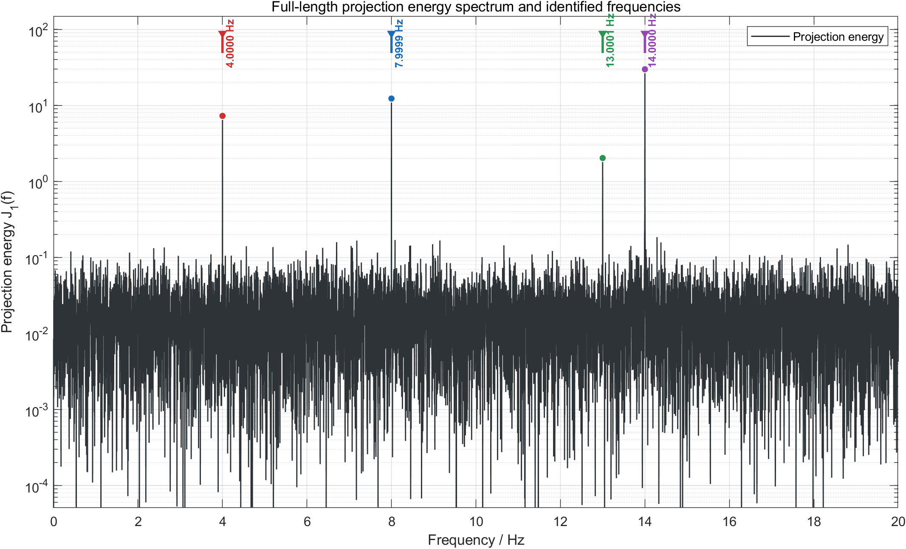
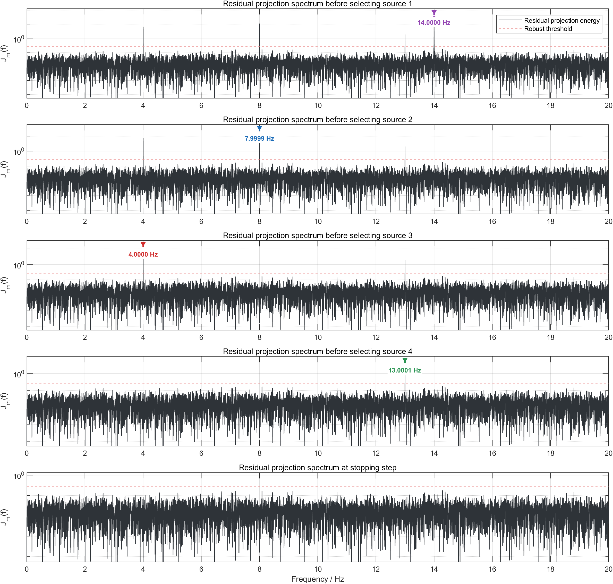
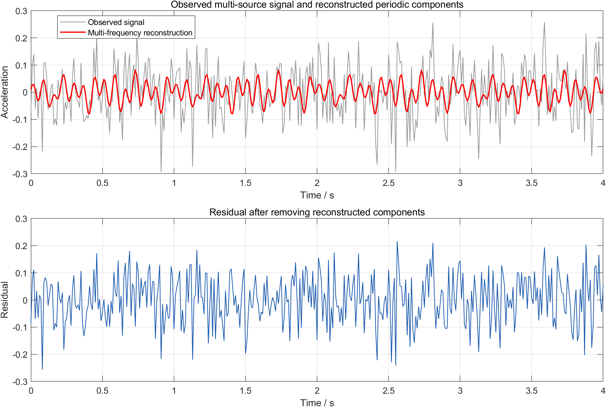
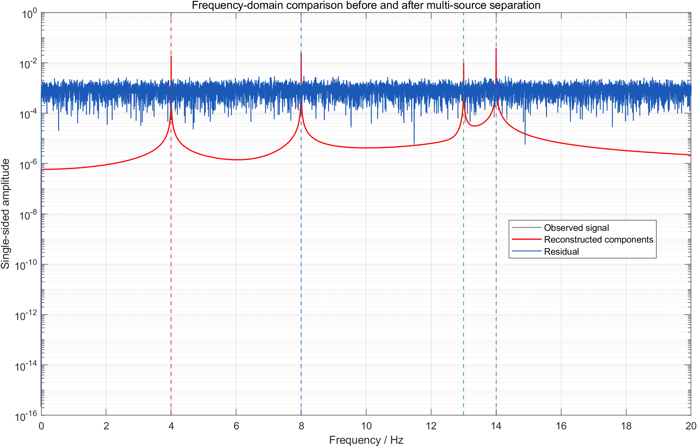
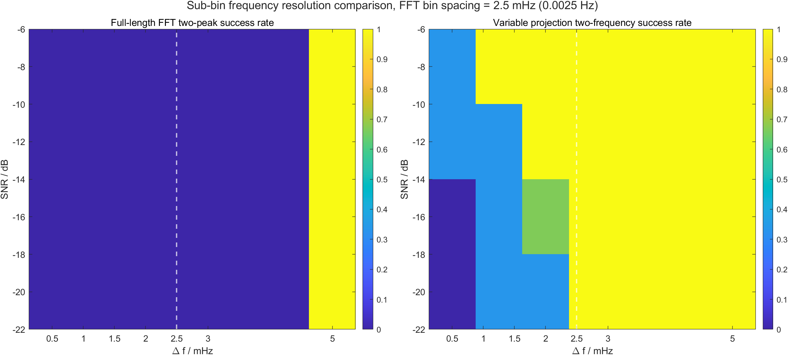

# 5.3 问题三模型的建立与求解

## 5.3.1 多故障源信号数据预处理

在多故障源情形下，单一传感器采集到的振动信号中可能同时包含多个不同频率的微弱周期分量。设附件中“多故障源”sheet 给出的原始观测序列为

\[
x_i=x(t_i),\qquad i=1,2,\cdots,N.
\]

与前两问保持一致，首先对原始信号进行去均值处理：

\[
y_i=x_i-\bar{x},\qquad 
\bar{x}=\frac{1}{N}\sum_{i=1}^{N}x_i.
\]

去均值可以去除不携带故障周期信息的直流偏置。由于本问需要估计各故障分量的振幅，主模型保留去均值信号的原始幅值尺度，不再对 \(y_i\) 作幅值归一化。

多故障源信号模型写为

\[
y(t_i)=\sum_{k=1}^{K}A_k\sin(2\pi f_k t_i+\varphi_k)+\varepsilon_i,
\]

其中 \(K\) 为故障源个数，\(f_k,A_k,\varphi_k\) 分别为第 \(k\) 个故障源的特征频率、振幅和初相，\(\varepsilon_i\) 表示噪声及未建模扰动。

## 5.3.2 基于全长正弦投影-OMP与局部变量投影精修的多故障源分离模型

本节建立两阶段多故障源分离模型：第一阶段用全长正弦投影-OMP 在残差中自动寻找多个显著故障频率；第二阶段在疑似近频或宽峰区域引入局部变量投影精修，将振幅和初相等线性参数消去，只对频率参数进行局部优化，以提高近频分辨能力。

### （1）多正弦模型的线性化表示

对任意候选频率 \(f\)，单个正弦分量可展开为

\[
A\sin(2\pi ft+\varphi)
=a\cos(2\pi ft)+b\sin(2\pi ft),
\]

其中

\[
a=A\sin\varphi,\qquad b=A\cos\varphi.
\]

于是对候选频率 \(f\)，构造正弦投影矩阵

\[
\mathbf H(f)=
\begin{bmatrix}
\cos(2\pi f t_1)&\sin(2\pi f t_1)\\
\cos(2\pi f t_2)&\sin(2\pi f t_2)\\
\vdots&\vdots\\
\cos(2\pi f t_N)&\sin(2\pi f t_N)
\end{bmatrix}.
\]

若频率 \(f\) 给定，余弦、正弦系数可由最小二乘直接估计：

\[
\hat{\boldsymbol\theta}(f)
=
\left[\mathbf H^T(f)\mathbf H(f)\right]^{-1}
\mathbf H^T(f)\mathbf y.
\]

对应的拟合分量为

\[
\hat{\mathbf s}(f)=\mathbf H(f)\hat{\boldsymbol\theta}(f).
\]

矩阵 \(\mathbf H(f)\) 的两列分别表示频率为 \(f\) 的余弦基和正弦基。由于任意初相的单频正弦都可以由这两个基线性组合得到，所以只要频率 \(f\) 给定，振幅和初相就可以转化为线性系数估计问题。这样做的好处是避免在每个候选频率上同时搜索 \(A\) 和 \(\varphi\)，显著降低了参数估计难度。

若 \(f\) 接近真实故障频率，观测信号在该二维正弦子空间上的全长投影能量会明显增大。其原因是：真实故障分量与同频正弦基在整个观测区间内相位持续一致，内积可以随样本长度相干累积；而随机噪声或频率不匹配的分量在长时间积分中正负抵消较多，投影能量相对较小。因此，全长投影能量谱可以作为弱周期故障频率的定位函数。

### （2）基于残差投影的 OMP 频率搜索

第 \(m\) 次迭代前，设当前残差为 \(\mathbf r^{(m-1)}\)。对任意候选频率 \(f\)，定义残差投影能量

\[
J_m(f)=
{\mathbf r^{(m-1)}}^{T}\mathbf H(f)
\left[\mathbf H^{T}(f)\mathbf H(f)\right]^{-1}
\mathbf H^{T}(f)\mathbf r^{(m-1)}.
\]

第 \(m\) 个故障候选频率由

\[
\hat f_m=\arg\max_f J_m(f)
\]

确定。该过程等价于在连续正弦字典中寻找与当前残差最相关的频率分量，因此可视为正交匹配追踪思想在正弦频率估计问题中的应用。

在多故障源情形下，第一次投影谱中的最大峰通常对应能量最强的故障分量。将该分量解释掉以后，残差中仍可能保留其他较弱故障分量。OMP 的作用就是在第 \(m\) 次迭代中不再对原始信号重复找峰，而是在上一轮残差 \(\mathbf r^{(m-1)}\) 中寻找尚未解释的周期结构。这样可以避免强故障频率长期支配谱图，使较弱频率在后续残差投影谱中逐渐显现。

需要注意的是，直接逐个扣除单频分量容易造成误差累积。例如，第一个频率的估计存在微小偏差时，简单扣除会把偏差带入残差，使后续频率估计受到污染。为此，每识别出一个新频率后，本文对当前所有已识别频率进行多频联合最小二乘重拟合。设已识别频率集合为

\[
\mathcal F_m=\{\hat f_1,\hat f_2,\cdots,\hat f_m\}.
\]

构造联合矩阵

\[
\mathbf H_m=
\left[
\cos(2\pi \hat f_1\mathbf t),\sin(2\pi \hat f_1\mathbf t),
\cdots,
\cos(2\pi \hat f_m\mathbf t),\sin(2\pi \hat f_m\mathbf t)
\right].
\]

联合系数估计为

\[
\hat{\boldsymbol\theta}_m
=
(\mathbf H_m^T\mathbf H_m)^{-1}\mathbf H_m^T\mathbf y,
\]

重构信号和残差分别为

\[
\hat{\mathbf s}_m=\mathbf H_m\hat{\boldsymbol\theta}_m,
\qquad
\mathbf r^{(m)}=\mathbf y-\hat{\mathbf s}_m.
\]

联合最小二乘的含义是：每加入一个新故障频率后，不固定前几轮得到的振幅和初相，而是在当前频率集合下重新估计所有分量的线性系数。这样可使多个分量共同解释原始信号，减少“先验扣除顺序”对最终结果的影响。

最后，对第 \(k\) 个频率，其余弦、正弦系数记为 \(a_k,b_k\)，则振幅和初相恢复为

\[
\hat A_k=\sqrt{a_k^2+b_k^2},
\qquad
\hat\varphi_k=\arctan2(a_k,b_k).
\]

### （3）局部变量投影精修

当两个故障频率非常接近时，单频投影峰可能发生重叠，OMP 可能先找到两个分量共同形成的合并峰。此时问题的难点并不在振幅、初相估计，而在频率参数之间存在较强耦合：只要频率略有变化，最优振幅和初相也会随之改变。为了进一步提高近频分辨能力，本文引入局部双频变量投影精修。

变量投影法的核心思想是将多频估计写成可分离非线性最小二乘问题。对给定频率向量

\[
\mathbf f=[f_1,f_2,\cdots,f_K]^T,
\]

构造多频字典矩阵

\[
\boldsymbol\Psi(\mathbf f)=
\left[
\cos(2\pi f_1\mathbf t),\sin(2\pi f_1\mathbf t),
\cdots,
\cos(2\pi f_K\mathbf t),\sin(2\pi f_K\mathbf t)
\right].
\]

多频拟合问题为

\[
\min_{\mathbf f,\mathbf c}
\left\|
\mathbf y-\boldsymbol\Psi(\mathbf f)\mathbf c
\right\|_2^2.
\]

其中 \(\mathbf f\) 是非线性频率参数，\(\mathbf c\) 是线性的振幅相位系数。对任意固定的 \(\mathbf f\)，线性系数都有闭式最小二乘解

\[
\hat{\mathbf c}(\mathbf f)
=
\boldsymbol\Psi^\dagger(\mathbf f)\mathbf y,
\]

其中 \(\boldsymbol\Psi^\dagger(\mathbf f)\) 表示 Moore--Penrose 伪逆。令

\[
P_{\boldsymbol\Psi(\mathbf f)}
=
\boldsymbol\Psi(\mathbf f)\boldsymbol\Psi^\dagger(\mathbf f)
\]

为投影到多频子空间的正交投影矩阵，则原问题可约化为只关于频率的优化问题：

\[
\min_{\mathbf f}
\left\|
\left(I-P_{\boldsymbol\Psi(\mathbf f)}\right)\mathbf y
\right\|_2^2.
\]

这是变量投影法的基本形式：把线性参数 \(\mathbf c\) 消去，只保留频率参数 \(\mathbf f\) 进行优化。与直接同时优化频率、振幅、相位相比，该方法维数更低，并且每个候选频率组合下都使用最优线性系数，因而更适合近频精修。换言之，变量投影不是把所有参数一起“盲目搜索”，而是对每一组候选频率都先求出最合理的振幅和初相，再比较剩余误差大小，从而把非线性搜索集中到最关键的频率变量上。

在本文实现中，变量投影作为 OMP 后的局部增强步骤。当某一局部频带可能包含两个相近频率时，以 OMP 或全长投影给出的峰值位置作为初值中心，构造双频模型

\[
\min_{f_1,f_2}
\left\|
\mathbf y-\boldsymbol\Psi(f_1,f_2)
\hat{\mathbf c}(f_1,f_2)
\right\|_2^2,
\]

其中

\[
\hat{\mathbf c}(f_1,f_2)
=
\left[\boldsymbol\Psi^T(f_1,f_2)\boldsymbol\Psi(f_1,f_2)\right]^{-1}
\boldsymbol\Psi^T(f_1,f_2)\mathbf y.
\]

然后在局部频率区间内搜索使约化残差最小的 \((f_1,f_2)\)。这种方法既保留了 OMP 的自动性，又能在近频场景中突破普通 FFT 的频率栅格限制。

## 5.3.3 故障源数判定

为了避免故障源个数误判，本文根据残差投影谱的稳健噪声底自动判定是否继续加入新的故障频率。“噪声底”是指在残差投影能量谱 \(J_m(f)\) 中，大多数非故障频率位置所形成的背景波动水平。若某一峰值只是在背景波动范围内，则不应把它解释为新的故障源。

首先，在每次残差投影谱中排除已识别频率附近的邻域，避免同一频率峰被重复选择。本文设置最小频率间隔为

\[
\Delta f_{\min}=0.01\ \mathrm{Hz}.
\]

然后，对有效频率区间上的残差投影能量样本 \(\{J_m(f_j)\}\) 计算中位数

\[
M_m=\mathrm{median}\{J_m(f_j)\},
\]

以及 MAD 稳健尺度估计

\[
\sigma_{\mathrm{MAD},m}
=1.4826\cdot
\mathrm{median}\left(|J_m(f_j)-M_m|\right).
\]

其中，\(\mathrm{median}(|J_m(f_j)-M_m|)\) 表示各频率点投影能量相对于中位数的典型偏离程度，反映残差投影谱背景的波动尺度。前面的系数 \(1.4826\) 是常用的一致性修正系数：当背景波动近似服从高斯分布时，修正后的 MAD 可与标准差处于同一量纲和尺度，便于构造类似“噪声底加若干倍波动”的阈值。

本文选用 median+MAD 而不直接使用均值和标准差，原因在于残差投影谱中可能存在少数非常突出的故障峰。这些强峰在统计意义上相当于离群大值，会显著抬高均值和标准差，使阈值被强故障峰牵引，进而掩盖较弱故障分量。中位数主要反映大多数普通频率点的背景水平，MAD 则刻画这些普通频率点围绕背景的稳健波动，因此更适合强峰、弱峰与噪声共存时的源数判定。

停止阈值定义为

\[
\eta_m=M_m+\lambda\sigma_{\mathrm{MAD},m},
\]

其中本文取

\[
\lambda=18.
\]

该取值为较保守的筛选策略：只有当残差投影峰明显高于背景波动时，才认为其是新的故障源。这样可以降低把随机噪声峰误判为故障频率的风险。

即当前最大峰值 \(J_m^{\max}\) 同时满足

\[
J_m^{\max}\ge \eta_m
\]

以及

\[
\frac{J_m^{\max}}{M_m}\ge 20
\]

时，才认为残差中仍存在显著周期故障分量，并继续加入该频率。否则停止迭代，并将当前已识别频率个数作为故障源数估计

\[
\hat K=m-1.
\]

其中，峰值/噪声底比值阈值 20 是对 \(\eta_m\) 的补充约束。前者关注峰值相对于背景绝对波动是否显著，后者关注峰值相对于背景中位水平是否足够突出。二者共同使用，可以避免在残差整体能量很低时，由很小的随机起伏触发误检。

因此，该源数判定准则由三个条件共同控制：稳健噪声底阈值用于判断峰值是否显著，峰值/噪声底比值用于避免弱随机峰误检，最小频率间隔用于防止同一故障峰被重复识别。本文取 \(\Delta f_{\min}=0.01\ \mathrm{Hz}\)，大于传统 FFT 栅格间隔 \(1/T=0.0025\ \mathrm{Hz}\)，其作用不是限制最终频率精估精度，而是在 OMP 选峰阶段避免同一宽峰或旁瓣被重复计为多个故障源。

## 5.3.4 问题求解过程

对 data.xlsx 中“多故障源”数据进行计算。图中给出了原始多故障信号对应的全长正弦投影能量谱 \(J_1(f)\)，以及自动识别出的多个故障特征频率。

投影-OMP 的迭代过程如下表所示。

| 迭代 | 粗定位频率 / Hz | 精估频率 / Hz | 峰值投影能量 | 峰值/噪声底 | 累计能量占比 |
|---:|---:|---:|---:|---:|---:|
| 1 | 13.999650 | 14.000024 | 29.796625 | 2163.361 | 0.070822 |
| 2 | 7.999800 | 7.999929 | 12.279573 | 892.686 | 0.098171 |
| 3 | 3.999900 | 3.999998 | 7.263044 | 528.815 | 0.114281 |
| 4 | 12.999675 | 13.000089 | 2.028304 | 147.679 | 0.119152 |

第 5 次迭代时，残差投影谱最大峰值约为

\[
0.185084,
\]

而稳健阈值约为

\[
0.270040,
\]

且峰值/噪声底比值约为

\[
13.476,
\]

低于设定阈值 20。停止继续扫描故障源，得到故障源个数

\[
\hat K=4.
\]

残差投影谱的逐步变化如下图所示。可以看到，强分量被依次提取后，对应频率峰在后续残差中明显削弱。

最终识别出的故障频率、振幅和初相如下表所示。

| 故障源 | 频率 / Hz | 振幅 | 初相 / rad | 能量占比 |
|---:|---:|---:|---:|---:|
| 1 | 3.999998185 | 0.019102914 | 1.371543820 | 0.016111 |
| 2 | 7.999928733 | 0.024889374 | -2.989236395 | 0.027349 |
| 3 | 13.000088597 | 0.010502940 | -2.157357956 | 0.004870 |
| 4 | 14.000024160 | 0.040052738 | 0.111605514 | 0.070822 |

因此，多故障源信号可恢复为

\[
\hat s(t)=\sum_{k=1}^{4}
\hat A_k\sin(2\pi \hat f_k t+\hat\varphi_k).
\]

代入数值可写为

\[
\begin{aligned}
\hat s(t)=&
0.019102914\sin(2\pi\cdot3.999998185t+1.371543820)\\
&+0.024889374\sin(2\pi\cdot7.999928733t-2.989236395)\\
&+0.010502940\sin(2\pi\cdot13.000088597t-2.157357956)\\
&+0.040052738\sin(2\pi\cdot14.000024160t+0.111605514).
\end{aligned}
\]

多频重构后的解释能量占比为

\[
R^2=0.119151588464,
\]

残差 RMS 为

\[
0.099879873631,
\]

相对于原始去均值信号的 RMS 降低约为

\[
0.550988\ \mathrm{dB}.
\]

下图展示了短时段内观测信号、多频重构信号和残差。由于故障分量相对于噪声仍然很弱，时域中重构信号不会完全贴合原始波形，但其周期结构已通过全长相干积累被提取出来。

频域对比表明，重构信号集中在识别出的 4 个故障频率附近，而残差中这些主峰明显削弱。

为检验源数判定的稳定性，改变稳健阈值倍数 \(\lambda\)，分别取

\[
\lambda=12,14,16,18,20,24.
\]

计算结果均自动识别出 4 个故障源，频率列表稳定为约 \(4,8,13,14\ \mathrm{Hz}\)，重构能量占比均为 \(0.119151588464\)，残差 RMS 均为 \(0.099879873631\)。这说明本数据中 4 个主故障频率峰相对于噪声底足够显著，源数判定对阈值倍数不敏感。

## 5.3.5 近频辨识极限实验

当两个故障频率非常接近时，投影峰会发生重叠，模型可能只能识别出一个合并峰，或者在强噪声下出现漏检。为了考察辨识极限，构造双频仿真实验：

\[
x(t)=A_1\sin(2\pi f_1t+\varphi_1)
+A_2\sin(2\pi f_2t+\varphi_2)+n(t),
\]

其中 \(f_1=10\ \mathrm{Hz}\)，\(f_2=f_1+\Delta f\)。因此，在每一组仿真中真实频率为

\[
\mathbf f_{\mathrm{true}}=
\left[
10,\quad 10+\Delta f
\right]^T\ \mathrm{Hz}.
\]

采样频率和观测时长与附件数据保持一致，即 \(f_s=100\ \mathrm{Hz}\)、\(T=400\ \mathrm{s}\)。改变频率间隔 \(\Delta f\) 和信噪比 SNR，多次重复实验并统计两个频率均被正确识别的比例。

本文将“正确识别”定义为：算法输出的估计频率中，至少存在两个不同频率 \(\hat f_a,\hat f_b\)，分别对应两个真实频率，且误差均不超过容许范围 \(\varepsilon\)，即

\[
|\hat f_a-f_1|\le \varepsilon,\qquad
|\hat f_b-f_2|\le \varepsilon,\qquad a\ne b.
\]

其中变量投影对比实验采用的误差容限为

\[
\varepsilon=\max\left(0.00012,\ \min(0.0012,\ 0.35\Delta f)\right)\ \mathrm{Hz}.
\]

该判据要求两个真实频率必须由两个不同的估计频率分别匹配。若模型只给出一个合并峰，或者两个估计值中有一个偏离真实频率过大，则该次实验记为识别失败。成功率即多次加噪重复实验中正确识别次数所占比例。

对比结果显示，传统 FFT 双峰拾取在 \(\Delta f<0.005\ \mathrm{Hz}\)（即 \(5\ \mathrm{mHz}\)）时基本不能稳定分辨两个近频分量，而变量投影法在信噪比较高时可以实现低于传统 FFT 栅格间隔的分辨能力。例如，在 \(\mathrm{SNR}=-8\ \mathrm{dB}\) 时，变量投影法在 \(\Delta f=0.001\ \mathrm{Hz}\)（即 \(1\ \mathrm{mHz}\)）时识别成功率达到 1；在 \(\mathrm{SNR}=-20\ \mathrm{dB}\) 时，\(\Delta f=0.002\ \mathrm{Hz}\)（即 \(2\ \mathrm{mHz}\)）的识别成功率也达到 1。该结果说明，全长投影-OMP 给出的频率初值可以进一步通过局部双频变量投影精修，从而突破传统 FFT 频率栅格限制。

## 5.3.6 本节小结

本节将前两问的全长正弦投影模型推广到多故障源情形，建立了“全长正弦投影-OMP + 局部变量投影精修”的多故障源分离模型。全长正弦投影-OMP 负责在残差中逐次搜索最显著的故障频率，并在每次加入新频率后进行多频联合最小二乘重拟合，从而避免逐次扣除造成误差累积。变量投影精修将振幅和初相对应的线性参数消去，只对频率参数进行局部优化。近频实验表明，该方法在信噪比较高时能够分辨低于传统 FFT 栅格间隔的两个近频分量，因此可作为全长投影-OMP 模型在近频故障场景下的增强步骤。
